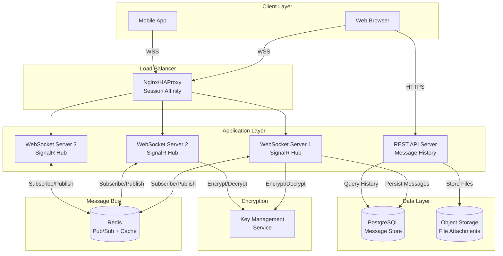
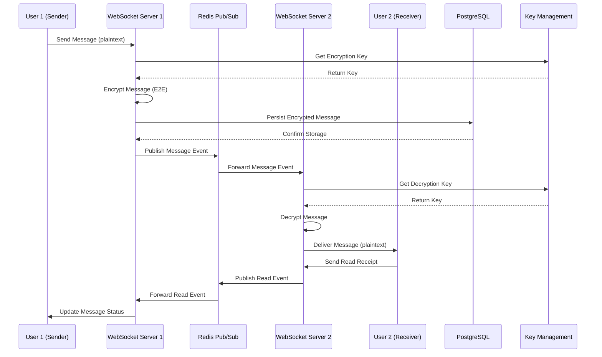
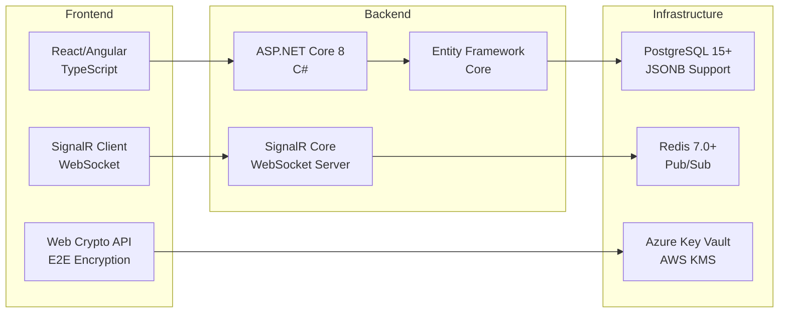
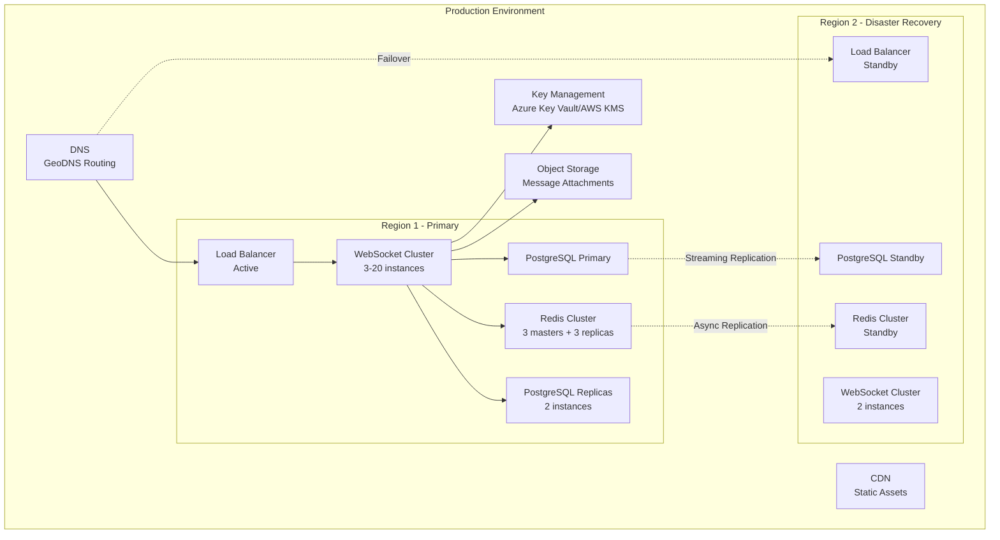
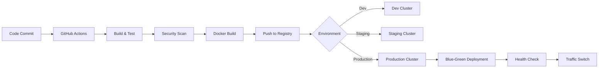

# Real-Time Chat Feature - Technical Design Document

**Version:** 1.0  
**Date:** 2026-02-12  
**Author:** Technical Design Team  
**Status:** Proposed

---

## Table of Contents
1. [Problem Statement](#problem-statement)
2. [Requirements](#requirements)
3. [System Architecture](#system-architecture)
4. [Component Breakdown](#component-breakdown)
5. [API Design](#api-design)
6. [Data Models](#data-models)
7. [Security Considerations](#security-considerations)
8. [Performance Requirements](#performance-requirements)
9. [Deployment Strategy](#deployment-strategy)
10. [Trade-offs and Alternatives](#trade-offs-and-alternatives)
11. [Success Metrics](#success-metrics)
12. [Implementation Roadmap](#implementation-roadmap)

---

## Problem Statement

The Employee Management System currently lacks real-time communication capabilities. Employees need a secure, scalable chat system to communicate instantly with colleagues, enhancing collaboration and productivity. The system must handle high concurrency, ensure message reliability, and provide end-to-end encryption for sensitive conversations.

### Business Goals
- Enable instant communication between employees
- Improve team collaboration and response times
- Ensure secure communication for sensitive business data
- Support company growth with scalable infrastructure

---

## Requirements

### Functional Requirements
1. **Real-time Messaging**: Instant message delivery using WebSocket protocol
2. **Message Persistence**: All messages stored in PostgreSQL database
3. **User Presence**: Online/offline status indicators
4. **Message History**: Ability to retrieve past conversations
5. **Typing Indicators**: Real-time typing status
6. **Read Receipts**: Message read/delivered status
7. **Direct Messages**: 1-on-1 conversations
8. **Group Chats**: Multi-user chat rooms (future enhancement)

### Non-Functional Requirements
1. **Scalability**: Support 10,000 concurrent users
2. **Security**: End-to-end encryption for all messages
3. **Performance**: Message delivery latency < 100ms
4. **Availability**: 99.9% uptime SLA
5. **Data Retention**: Message history for 1 year
6. **Reliability**: Message delivery guarantee (at-least-once semantics)

---

## System Architecture

### High-Level Architecture Diagram



### Component Interaction Sequence



### Technology Stack



---

## Component Breakdown

### 1. WebSocket Server (SignalR Hub)

**Responsibilities:**
- Maintain persistent WebSocket connections
- Handle user authentication and authorization
- Route messages between users
- Manage user presence (online/offline)
- Implement connection recovery and reconnection logic
- Rate limiting and abuse prevention

**Technologies:**
- ASP.NET Core SignalR
- WebSocket protocol with fallback to Server-Sent Events (SSE)

**Key Classes:**
```csharp
// ChatHub.cs - SignalR Hub
public class ChatHub : Hub
{
    Task SendMessage(string recipientId, EncryptedMessage message);
    Task JoinRoom(string roomId);
    Task LeaveRoom(string roomId);
    Task SendTypingIndicator(string recipientId);
    Task UpdatePresence(PresenceStatus status);
}
```

**Scalability Considerations:**
- Horizontal scaling with Redis backplane
- Session affinity at load balancer
- Connection pooling and management
- Graceful degradation under load

### 2. Message Service

**Responsibilities:**
- Validate and sanitize messages
- Encrypt/decrypt message content
- Persist messages to database
- Retrieve message history
- Handle message attachments
- Implement message threading

**Key Classes:**
```csharp
// IMessageService.cs
public interface IMessageService
{
    Task<Message> SendMessageAsync(SendMessageDto dto);
    Task<IEnumerable<Message>> GetConversationAsync(string user1Id, string user2Id, int pageSize, int page);
    Task<Message> GetMessageByIdAsync(Guid messageId);
    Task MarkAsReadAsync(Guid messageId, string userId);
    Task DeleteMessageAsync(Guid messageId, string userId);
}

// MessageService.cs
public class MessageService : IMessageService
{
    private readonly IMessageRepository _repository;
    private readonly IEncryptionService _encryption;
    private readonly IChatNotifier _notifier;
    
    // Implementation...
}
```

### 3. Encryption Service

**Responsibilities:**
- Generate and manage encryption keys
- Encrypt message content using AES-256-GCM
- Decrypt messages for authorized users
- Key rotation and management
- Secure key storage in Key Management Service

**Key Classes:**
```csharp
// IEncryptionService.cs
public interface IEncryptionService
{
    Task<EncryptedData> EncryptAsync(string plaintext, string userId);
    Task<string> DecryptAsync(EncryptedData encryptedData, string userId);
    Task<KeyPair> GenerateKeyPairAsync(string userId);
    Task RotateKeysAsync(string userId);
}

// Implementation uses Azure Key Vault or AWS KMS
```

**Encryption Flow:**
1. **Key Generation**: Each user has a unique encryption key pair
2. **Message Encryption**: Sender's public key encrypts message
3. **Key Exchange**: Diffie-Hellman for shared secrets
4. **Storage**: Only encrypted data stored in database
5. **Decryption**: Recipient's private key decrypts message

### 4. Presence Service

**Responsibilities:**
- Track user online/offline status
- Broadcast presence changes
- Handle connection timeouts
- Manage "last seen" timestamps
- Implement "away" and "busy" statuses

**Key Classes:**
```csharp
// IPresenceService.cs
public interface IPresenceService
{
    Task SetUserOnlineAsync(string userId, string connectionId);
    Task SetUserOfflineAsync(string userId, string connectionId);
    Task<PresenceStatus> GetUserPresenceAsync(string userId);
    Task<Dictionary<string, PresenceStatus>> GetBulkPresenceAsync(IEnumerable<string> userIds);
}
```

**Implementation:**
- Redis for fast presence lookups
- TTL-based automatic offline detection
- Connection ID tracking for multiple devices

### 5. Message Repository

**Responsibilities:**
- CRUD operations for messages
- Efficient querying with pagination
- Conversation threading
- Full-text search capabilities
- Optimized indexes for performance

**Key Classes:**
```csharp
// IMessageRepository.cs
public interface IMessageRepository
{
    Task<Message> AddAsync(Message message);
    Task<Message> GetByIdAsync(Guid messageId);
    Task<IEnumerable<Message>> GetConversationAsync(
        string user1Id, 
        string user2Id, 
        int pageSize, 
        int page,
        DateTime? beforeDate = null
    );
    Task<int> GetUnreadCountAsync(string userId);
    Task UpdateAsync(Message message);
    Task DeleteAsync(Guid messageId);
}
```

### 6. Redis Backplane

**Responsibilities:**
- Scale-out SignalR across multiple servers
- Pub/Sub for message distribution
- Cache frequently accessed data
- Store temporary typing indicators
- Presence data caching

**Configuration:**
```csharp
// Program.cs
services.AddSignalR()
    .AddStackExchangeRedis(options =>
    {
        options.Configuration.ChannelPrefix = "ChatApp";
        options.Configuration.AbortOnConnectFail = false;
    });
```

---

## API Design

### WebSocket API (SignalR)

#### Connection
```typescript
// Client establishes WebSocket connection
const connection = new HubConnectionBuilder()
    .withUrl("/chathub", { 
        accessTokenFactory: () => getAuthToken() 
    })
    .withAutomaticReconnect()
    .build();

await connection.start();
```

#### Send Message
```typescript
// Client -> Server
await connection.invoke("SendMessage", {
    recipientId: "user-123",
    content: "Hello!",
    messageType: "text",
    clientMessageId: "uuid-v4" // For idempotency
});

// Server -> Client (recipient)
connection.on("ReceiveMessage", (message) => {
    // message: { id, senderId, content, timestamp, ... }
});
```

#### Typing Indicator
```typescript
// Client -> Server
await connection.invoke("SendTypingIndicator", {
    recipientId: "user-123",
    isTyping: true
});

// Server -> Client
connection.on("UserTyping", (data) => {
    // data: { userId, isTyping }
});
```

#### Presence Updates
```typescript
// Server -> Client
connection.on("PresenceChanged", (data) => {
    // data: { userId, status: "online|offline|away", lastSeen }
});
```

#### Read Receipts
```typescript
// Client -> Server
await connection.invoke("MarkAsRead", {
    messageId: "msg-uuid"
});

// Server -> Client (sender)
connection.on("MessageRead", (data) => {
    // data: { messageId, readBy, readAt }
});
```

### REST API (Message History & Management)

#### Get Conversation History
```http
GET /api/v1/messages/conversations/{userId}
Query Parameters:
  - page: int (default: 1)
  - pageSize: int (default: 50, max: 100)
  - beforeDate: ISO8601 timestamp (optional)

Response:
{
    "data": [
        {
            "id": "uuid",
            "senderId": "user-123",
            "recipientId": "user-456",
            "content": "encrypted-content",
            "contentType": "text",
            "timestamp": "2026-02-12T10:00:00Z",
            "status": "delivered|read",
            "readAt": "2026-02-12T10:05:00Z"
        }
    ],
    "pagination": {
        "page": 1,
        "pageSize": 50,
        "totalCount": 250,
        "hasNextPage": true
    }
}
```

#### Get Unread Messages Count
```http
GET /api/v1/messages/unread/count

Response:
{
    "totalUnreadCount": 15,
    "conversationCounts": [
        { "userId": "user-123", "count": 10 },
        { "userId": "user-456", "count": 5 }
    ]
}
```

#### Search Messages
```http
GET /api/v1/messages/search
Query Parameters:
  - query: string (required)
  - userId: string (optional, search in specific conversation)
  - dateFrom: ISO8601
  - dateTo: ISO8601

Response:
{
    "results": [
        {
            "messageId": "uuid",
            "conversationWith": "user-123",
            "snippet": "...matching text...",
            "timestamp": "2026-02-12T10:00:00Z"
        }
    ],
    "totalMatches": 42
}
```

#### Delete Message
```http
DELETE /api/v1/messages/{messageId}

Response:
{
    "success": true,
    "deletedAt": "2026-02-12T10:00:00Z"
}
```

### Error Handling

**WebSocket Errors:**
```typescript
connection.on("Error", (error) => {
    // error: { code, message, retryable }
    // codes: 
    //   - RATE_LIMIT_EXCEEDED
    //   - INVALID_RECIPIENT
    //   - ENCRYPTION_FAILED
    //   - MESSAGE_TOO_LARGE
});
```

**HTTP Error Responses:**
```json
{
    "error": {
        "code": "VALIDATION_ERROR",
        "message": "Message content exceeds maximum length",
        "details": {
            "maxLength": 10000,
            "actualLength": 15000
        }
    }
}
```

---

## Data Models

### Database Schema (PostgreSQL)

```sql
-- Users table (extends existing Employee table)
CREATE TABLE chat_users (
    id UUID PRIMARY KEY DEFAULT gen_random_uuid(),
    employee_id INTEGER REFERENCES employees(id) NOT NULL,
    public_key TEXT NOT NULL,
    private_key_encrypted TEXT NOT NULL,
    key_version INTEGER DEFAULT 1,
    created_at TIMESTAMP DEFAULT CURRENT_TIMESTAMP,
    updated_at TIMESTAMP DEFAULT CURRENT_TIMESTAMP,
    CONSTRAINT unique_employee UNIQUE(employee_id)
);

-- Messages table
CREATE TABLE messages (
    id UUID PRIMARY KEY DEFAULT gen_random_uuid(),
    sender_id UUID REFERENCES chat_users(id) NOT NULL,
    recipient_id UUID REFERENCES chat_users(id) NOT NULL,
    content_encrypted TEXT NOT NULL,
    content_type VARCHAR(50) DEFAULT 'text', -- text, file, image
    encryption_metadata JSONB NOT NULL, -- IV, auth tag, algorithm version
    status VARCHAR(20) DEFAULT 'sent', -- sent, delivered, read
    client_message_id UUID, -- For idempotency
    thread_id UUID, -- For message threading (future)
    created_at TIMESTAMP DEFAULT CURRENT_TIMESTAMP,
    delivered_at TIMESTAMP,
    read_at TIMESTAMP,
    deleted_at TIMESTAMP, -- Soft delete
    CONSTRAINT valid_status CHECK (status IN ('sent', 'delivered', 'read', 'failed'))
);

-- Indexes for performance
CREATE INDEX idx_messages_sender_recipient ON messages(sender_id, recipient_id, created_at DESC);
CREATE INDEX idx_messages_recipient_unread ON messages(recipient_id, status) WHERE status != 'read' AND deleted_at IS NULL;
CREATE INDEX idx_messages_client_id ON messages(client_message_id) WHERE client_message_id IS NOT NULL;
CREATE INDEX idx_messages_created_at ON messages(created_at DESC);

-- Message attachments (for file sharing)
CREATE TABLE message_attachments (
    id UUID PRIMARY KEY DEFAULT gen_random_uuid(),
    message_id UUID REFERENCES messages(id) ON DELETE CASCADE,
    file_name VARCHAR(255) NOT NULL,
    file_size BIGINT NOT NULL,
    file_type VARCHAR(100) NOT NULL,
    storage_path TEXT NOT NULL, -- S3/Azure Blob path
    encrypted BOOLEAN DEFAULT true,
    created_at TIMESTAMP DEFAULT CURRENT_TIMESTAMP
);

-- User presence (can be in Redis, but PostgreSQL for persistence)
CREATE TABLE user_presence (
    user_id UUID PRIMARY KEY REFERENCES chat_users(id),
    status VARCHAR(20) DEFAULT 'offline', -- online, offline, away, busy
    last_seen TIMESTAMP DEFAULT CURRENT_TIMESTAMP,
    connection_count INTEGER DEFAULT 0, -- Multiple devices
    updated_at TIMESTAMP DEFAULT CURRENT_TIMESTAMP,
    CONSTRAINT valid_presence_status CHECK (status IN ('online', 'offline', 'away', 'busy'))
);

-- Conversation metadata (for quick lookups)
CREATE TABLE conversations (
    id UUID PRIMARY KEY DEFAULT gen_random_uuid(),
    participant1_id UUID REFERENCES chat_users(id) NOT NULL,
    participant2_id UUID REFERENCES chat_users(id) NOT NULL,
    last_message_id UUID REFERENCES messages(id),
    last_message_at TIMESTAMP,
    unread_count_p1 INTEGER DEFAULT 0,
    unread_count_p2 INTEGER DEFAULT 0,
    created_at TIMESTAMP DEFAULT CURRENT_TIMESTAMP,
    updated_at TIMESTAMP DEFAULT CURRENT_TIMESTAMP,
    CONSTRAINT unique_conversation UNIQUE(participant1_id, participant2_id),
    CONSTRAINT valid_participants CHECK (participant1_id < participant2_id)
);

CREATE INDEX idx_conversations_participant1 ON conversations(participant1_id, last_message_at DESC);
CREATE INDEX idx_conversations_participant2 ON conversations(participant2_id, last_message_at DESC);

-- Full-text search (PostgreSQL GIN index)
CREATE EXTENSION IF NOT EXISTS pg_trgm;
CREATE INDEX idx_messages_content_search ON messages USING gin(content_encrypted gin_trgm_ops);

-- Audit log for compliance
CREATE TABLE message_audit_log (
    id UUID PRIMARY KEY DEFAULT gen_random_uuid(),
    message_id UUID REFERENCES messages(id),
    action VARCHAR(50) NOT NULL, -- created, read, deleted
    user_id UUID REFERENCES chat_users(id),
    ip_address INET,
    user_agent TEXT,
    created_at TIMESTAMP DEFAULT CURRENT_TIMESTAMP
);
```

### Entity Classes (C#)

```csharp
// Message.cs
public class Message
{
    public Guid Id { get; set; }
    public Guid SenderId { get; set; }
    public Guid RecipientId { get; set; }
    public string ContentEncrypted { get; set; }
    public string ContentType { get; set; }
    public EncryptionMetadata EncryptionMetadata { get; set; }
    public MessageStatus Status { get; set; }
    public Guid? ClientMessageId { get; set; }
    public DateTime CreatedAt { get; set; }
    public DateTime? DeliveredAt { get; set; }
    public DateTime? ReadAt { get; set; }
    public DateTime? DeletedAt { get; set; }
    
    // Navigation properties
    public ChatUser Sender { get; set; }
    public ChatUser Recipient { get; set; }
    public ICollection<MessageAttachment> Attachments { get; set; }
}

// ChatUser.cs
public class ChatUser
{
    public Guid Id { get; set; }
    public int EmployeeId { get; set; }
    public string PublicKey { get; set; }
    public string PrivateKeyEncrypted { get; set; }
    public int KeyVersion { get; set; }
    public DateTime CreatedAt { get; set; }
    public DateTime UpdatedAt { get; set; }
    
    // Navigation properties
    public Employee Employee { get; set; }
    public ICollection<Message> SentMessages { get; set; }
    public ICollection<Message> ReceivedMessages { get; set; }
}

// EncryptionMetadata.cs (stored as JSONB)
public class EncryptionMetadata
{
    public string InitializationVector { get; set; }
    public string AuthenticationTag { get; set; }
    public string Algorithm { get; set; } = "AES-256-GCM";
    public int KeyVersion { get; set; }
}

// DTOs
public class SendMessageDto
{
    [Required]
    public string RecipientId { get; set; }
    
    [Required]
    [MaxLength(10000)]
    public string Content { get; set; }
    
    public string ContentType { get; set; } = "text";
    
    public Guid? ClientMessageId { get; set; }
    
    public List<IFormFile> Attachments { get; set; }
}

public class MessageDto
{
    public Guid Id { get; set; }
    public string SenderId { get; set; }
    public string RecipientId { get; set; }
    public string Content { get; set; } // Decrypted
    public string ContentType { get; set; }
    public MessageStatus Status { get; set; }
    public DateTime Timestamp { get; set; }
    public DateTime? ReadAt { get; set; }
    public List<AttachmentDto> Attachments { get; set; }
}

public enum MessageStatus
{
    Sent,
    Delivered,
    Read,
    Failed
}
```

### Redis Data Structures

```
# User presence (Hash)
Key: presence:{userId}
Fields:
  - status: online|offline|away|busy
  - lastSeen: timestamp
  - connectionIds: set of connection IDs

# Typing indicators (String with TTL)
Key: typing:{conversationId}:{userId}
Value: 1
TTL: 3 seconds

# Online users (Sorted Set)
Key: users:online
Score: timestamp
Member: userId

# Unread counts cache (Hash)
Key: unread:{userId}
Fields:
  - {conversationId}: count
```

---

## Security Considerations

### 1. End-to-End Encryption (E2E)

**Implementation Strategy:**
- **Hybrid Encryption**: Combine symmetric (AES-256-GCM) and asymmetric (RSA-4096) encryption
- **Key Exchange**: Use Elliptic Curve Diffie-Hellman (ECDH) for establishing shared secrets
- **Perfect Forward Secrecy**: Generate new session keys for each conversation
- **Key Storage**: Private keys encrypted with user's password-derived key (PBKDF2)

**Encryption Flow:**
```
1. User Registration:
   - Generate RSA-4096 key pair
   - Encrypt private key with password-derived key (PBKDF2 + salt)
   - Store public key in database
   - Store encrypted private key in database

2. Sending Message:
   - Client generates random AES-256 key (session key)
   - Encrypt message content with session key using AES-256-GCM
   - Encrypt session key with recipient's RSA public key
   - Send encrypted message + encrypted session key to server
   - Server stores encrypted message (cannot decrypt)

3. Receiving Message:
   - Server forwards encrypted message to recipient
   - Client decrypts session key with private RSA key
   - Client decrypts message content with session key
```

**Key Rotation:**
- Automatic key rotation every 90 days
- On-demand rotation if compromise suspected
- Backward compatibility with key versioning

### 2. Authentication & Authorization

**Authentication:**
- JWT token-based authentication
- Token refresh mechanism
- WebSocket connection authenticated via token in query string or header

```csharp
// ChatHub.cs
public override async Task OnConnectedAsync()
{
    var userId = Context.User?.FindFirst(ClaimTypes.NameIdentifier)?.Value;
    if (string.IsNullOrEmpty(userId))
    {
        Context.Abort();
        return;
    }
    
    await _presenceService.SetUserOnlineAsync(userId, Context.ConnectionId);
    await base.OnConnectedAsync();
}
```

**Authorization:**
- Users can only send messages to employees in same organization
- Users can only read their own conversations
- Administrators cannot decrypt user messages (E2E encryption)

### 3. Input Validation & Sanitization

**Message Content:**
- Maximum message length: 10,000 characters
- HTML sanitization to prevent XSS
- URL validation and safe link rendering
- File upload restrictions: max 10MB, allowed types only

```csharp
public class MessageValidator : AbstractValidator<SendMessageDto>
{
    public MessageValidator()
    {
        RuleFor(x => x.Content)
            .NotEmpty()
            .MaximumLength(10000)
            .Must(BeValidContent)
            .WithMessage("Message contains invalid content");
            
        RuleFor(x => x.RecipientId)
            .NotEmpty()
            .Must(BeValidGuid);
    }
}
```

### 4. Rate Limiting

**Purpose:** Prevent spam and abuse

**Limits:**
- 50 messages per minute per user
- 1000 messages per hour per user
- 10 typing indicators per minute
- Connection limit: 3 concurrent connections per user

**Implementation:**
```csharp
// Rate limiting middleware using AspNetCoreRateLimit
services.Configure<IpRateLimitOptions>(options =>
{
    options.GeneralRules = new List<RateLimitRule>
    {
        new RateLimitRule
        {
            Endpoint = "/chathub",
            Period = "1m",
            Limit = 100
        }
    };
});
```

### 5. Security Headers

```csharp
app.Use(async (context, next) =>
{
    context.Response.Headers.Add("X-Content-Type-Options", "nosniff");
    context.Response.Headers.Add("X-Frame-Options", "DENY");
    context.Response.Headers.Add("X-XSS-Protection", "1; mode=block");
    context.Response.Headers.Add("Strict-Transport-Security", "max-age=31536000");
    context.Response.Headers.Add("Content-Security-Policy", 
        "default-src 'self'; connect-src 'self' wss:;");
    await next();
});
```

### 6. Compliance & Audit

**GDPR Compliance:**
- User consent for data collection
- Right to data export
- Right to deletion (message deletion)
- Data retention policies (1 year)

**Audit Logging:**
- Log all message operations (create, read, delete)
- Log authentication events
- Log key rotation events
- Retain audit logs for 2 years

---

## Performance Requirements

### Target Metrics

| Metric | Target | Measurement |
|--------|--------|-------------|
| **Concurrent Users** | 10,000+ | Active WebSocket connections |
| **Message Latency** | < 100ms | End-to-end delivery time (p95) |
| **Message Throughput** | 10,000 msg/sec | System-wide message processing |
| **Database Latency** | < 50ms | Query response time (p95) |
| **Connection Establishment** | < 500ms | WebSocket handshake time |
| **CPU Usage** | < 70% | Average across all servers |
| **Memory Usage** | < 80% | Average across all servers |
| **Availability** | 99.9% | Monthly uptime |

### Scalability Strategy

#### Horizontal Scaling

**WebSocket Servers:**
- Stateless server design
- Auto-scaling based on connection count
- Target: 2,000 connections per server instance
- Scale out trigger: > 1,500 connections per instance
- Minimum instances: 3 (for redundancy)
- Maximum instances: 20 (handle 40,000 concurrent users)

**Infrastructure:**
```
Load Balancer (Nginx)
  ├── WebSocket Server 1 (2,000 connections)
  ├── WebSocket Server 2 (2,000 connections)
  ├── WebSocket Server 3 (2,000 connections)
  ├── ...
  └── WebSocket Server N (2,000 connections)
        ↓
    Redis Cluster (Pub/Sub + Cache)
        ↓
    PostgreSQL (Primary + Read Replicas)
```

**Auto-Scaling Configuration (Kubernetes):**
```yaml
apiVersion: autoscaling/v2
kind: HorizontalPodAutoscaler
metadata:
  name: chat-server-hpa
spec:
  scaleTargetRef:
    apiVersion: apps/v1
    kind: Deployment
    name: chat-server
  minReplicas: 3
  maxReplicas: 20
  metrics:
  - type: Resource
    resource:
      name: cpu
      target:
        type: Utilization
        averageUtilization: 70
  - type: Pods
    pods:
      metric:
        name: websocket_connections
      target:
        type: AverageValue
        averageValue: "1500"
```

#### Database Optimization

**PostgreSQL Configuration:**
- **Primary**: Write operations (message insert)
- **Read Replicas**: Read operations (message history, search)
- **Connection Pooling**: PgBouncer (max 100 connections per server)
- **Partitioning**: Partition messages table by created_at (monthly partitions)

```sql
-- Table partitioning for messages
CREATE TABLE messages_2026_02 PARTITION OF messages
    FOR VALUES FROM ('2026-02-01') TO ('2026-03-01');

CREATE TABLE messages_2026_03 PARTITION OF messages
    FOR VALUES FROM ('2026-03-01') TO ('2026-04-01');
```

**Index Strategy:**
```sql
-- Composite index for conversation queries
CREATE INDEX idx_messages_conversation 
ON messages(sender_id, recipient_id, created_at DESC)
WHERE deleted_at IS NULL;

-- Partial index for unread messages
CREATE INDEX idx_messages_unread 
ON messages(recipient_id, created_at DESC)
WHERE status != 'read' AND deleted_at IS NULL;

-- BRIN index for time-series data
CREATE INDEX idx_messages_created_brin 
ON messages USING BRIN(created_at);
```

**Query Optimization:**
```csharp
// Efficient conversation query with pagination
public async Task<IEnumerable<Message>> GetConversationAsync(
    Guid user1Id, Guid user2Id, int pageSize, int page)
{
    return await _context.Messages
        .Where(m => 
            (m.SenderId == user1Id && m.RecipientId == user2Id) ||
            (m.SenderId == user2Id && m.RecipientId == user1Id))
        .Where(m => m.DeletedAt == null)
        .OrderByDescending(m => m.CreatedAt)
        .Skip((page - 1) * pageSize)
        .Take(pageSize)
        .AsNoTracking() // Read-only, no change tracking
        .ToListAsync();
}
```

#### Redis Optimization

**Configuration:**
- **Deployment**: Redis Cluster (3 masters + 3 replicas)
- **Memory**: 32GB per node
- **Persistence**: RDB snapshots + AOF (every second)
- **Eviction Policy**: allkeys-lru (for cache data)

**Usage:**
- Pub/Sub for message distribution (ephemeral)
- Cache for user presence (TTL: 5 minutes)
- Cache for conversation metadata (TTL: 1 hour)
- Store typing indicators (TTL: 3 seconds)

```csharp
// Redis caching example
public async Task<PresenceStatus> GetUserPresenceAsync(string userId)
{
    var cacheKey = $"presence:{userId}";
    
    // Try cache first
    var cached = await _cache.StringGetAsync(cacheKey);
    if (cached.HasValue)
        return JsonSerializer.Deserialize<PresenceStatus>(cached);
    
    // Fallback to database
    var presence = await _presenceRepository.GetByUserIdAsync(userId);
    
    // Cache for 5 minutes
    await _cache.StringSetAsync(
        cacheKey, 
        JsonSerializer.Serialize(presence),
        TimeSpan.FromMinutes(5)
    );
    
    return presence;
}
```

### Load Testing

**Tools:**
- Artillery.io for WebSocket load testing
- k6 for REST API load testing

**Test Scenarios:**
1. **Connection Storm**: 10,000 concurrent connections in 60 seconds
2. **Message Flood**: 10,000 messages/second for 5 minutes
3. **Mixed Load**: 8,000 active users with realistic usage patterns
4. **Failover Test**: Kill 1/3 of servers during peak load

**Sample Artillery Configuration:**
```yaml
config:
  target: "wss://chat.example.com"
  phases:
    - duration: 60
      arrivalRate: 167  # 10,000 users in 60 seconds
      name: "Ramp up"
    - duration: 300
      arrivalRate: 50
      name: "Sustained load"
  engines:
    socketio:
      transports: ["websocket"]

scenarios:
  - name: "Send messages"
    engine: "socketio"
    flow:
      - emit:
          channel: "SendMessage"
          data:
            recipientId: "{{ $randomString() }}"
            content: "Test message {{ $randomString() }}"
```

### Performance Monitoring

**Metrics to Track:**
- WebSocket connection count per server
- Message latency (p50, p95, p99)
- Message throughput (messages/second)
- Database query times
- Redis latency
- CPU and memory usage
- Error rates

**Tools:**
- Prometheus + Grafana for metrics
- Application Insights / New Relic for APM
- ELK Stack for log analysis

**Example Dashboard:**
```
┌─────────────────────────────────────────┐
│ Real-Time Chat Monitoring               │
├─────────────────────────────────────────┤
│ Active Connections: 9,847 / 10,000      │
│ Message Latency (p95): 78ms             │
│ Messages/sec: 4,521                     │
│ CPU Usage: 62% ████████▓░░              │
│ Memory Usage: 71% █████████░░           │
│ Error Rate: 0.02% ▁▁▁▁▁▁▁               │
└─────────────────────────────────────────┘
```

---

## Deployment Strategy

### Architecture Deployment



### Deployment Pipeline (CI/CD)



**GitHub Actions Workflow:**
```yaml
name: Chat Service Deployment

on:
  push:
    branches: [main]
    paths:
      - 'src/ChatService/**'

jobs:
  build-and-deploy:
    runs-on: ubuntu-latest
    steps:
      - uses: actions/checkout@v3
      
      - name: Build Docker Image
        run: |
          docker build -t chat-service:${{ github.sha }} .
          
      - name: Run Tests
        run: dotnet test --no-build
        
      - name: Security Scan
        uses: aquasecurity/trivy-action@master
        with:
          image-ref: chat-service:${{ github.sha }}
          
      - name: Push to Registry
        run: |
          docker push chat-service:${{ github.sha }}
          
      - name: Deploy to Kubernetes
        uses: azure/k8s-deploy@v1
        with:
          manifests: |
            k8s/deployment.yaml
            k8s/service.yaml
          images: |
            chat-service:${{ github.sha }}
          strategy: blue-green
```

### Kubernetes Deployment

**Deployment Manifest:**
```yaml
apiVersion: apps/v1
kind: Deployment
metadata:
  name: chat-service
  labels:
    app: chat-service
spec:
  replicas: 3
  strategy:
    type: RollingUpdate
    rollingUpdate:
      maxSurge: 1
      maxUnavailable: 0
  selector:
    matchLabels:
      app: chat-service
  template:
    metadata:
      labels:
        app: chat-service
    spec:
      containers:
      - name: chat-service
        image: chat-service:latest
        ports:
        - containerPort: 80
        - containerPort: 443
        env:
        - name: REDIS_CONNECTION
          valueFrom:
            secretKeyRef:
              name: chat-secrets
              key: redis-connection
        - name: DATABASE_CONNECTION
          valueFrom:
            secretKeyRef:
              name: chat-secrets
              key: db-connection
        resources:
          requests:
            cpu: 500m
            memory: 1Gi
          limits:
            cpu: 2000m
            memory: 4Gi
        livenessProbe:
          httpGet:
            path: /health
            port: 80
          initialDelaySeconds: 30
          periodSeconds: 10
        readinessProbe:
          httpGet:
            path: /ready
            port: 80
          initialDelaySeconds: 10
          periodSeconds: 5
```

**Service Manifest:**
```yaml
apiVersion: v1
kind: Service
metadata:
  name: chat-service
spec:
  type: LoadBalancer
  sessionAffinity: ClientIP  # Sticky sessions for WebSocket
  sessionAffinityConfig:
    clientIP:
      timeoutSeconds: 3600
  ports:
  - port: 80
    targetPort: 80
    name: http
  - port: 443
    targetPort: 443
    name: https
  selector:
    app: chat-service
```

### Database Migration Strategy

**Zero-Downtime Migration:**
1. **Phase 1**: Deploy new schema alongside old schema
2. **Phase 2**: Dual-write to both schemas
3. **Phase 3**: Migrate historical data in background
4. **Phase 4**: Switch reads to new schema
5. **Phase 5**: Remove old schema

**Migration Script Example:**
```csharp
// Program.cs - Database initialization
public static async Task InitializeDatabaseAsync(IServiceProvider services)
{
    using var scope = services.CreateScope();
    var context = scope.ServiceProvider.GetRequiredService<ChatDbContext>();
    
    // Apply migrations
    await context.Database.MigrateAsync();
    
    // Seed initial data if needed
    if (!await context.ChatUsers.AnyAsync())
    {
        await SeedDataAsync(context);
    }
}
```

### Monitoring & Alerting

**Health Checks:**
```csharp
// Program.cs
builder.Services.AddHealthChecks()
    .AddCheck<DatabaseHealthCheck>("database")
    .AddCheck<RedisHealthCheck>("redis")
    .AddCheck<SignalRHealthCheck>("signalr");

app.MapHealthChecks("/health", new HealthCheckOptions
{
    ResponseWriter = UIResponseWriter.WriteHealthCheckUIResponse
});
```

**Alerts:**
- WebSocket connection count > 18,000 (90% capacity)
- Message latency p95 > 200ms
- Error rate > 1%
- Database connection pool > 80%
- Redis memory usage > 85%
- Server CPU > 85% for 5 minutes

---

## Trade-offs and Alternatives

### 1. WebSocket vs. Alternatives

**Chosen: WebSocket (SignalR)**

**Alternatives Considered:**

| Technology | Pros | Cons | Decision |
|------------|------|------|----------|
| **Long Polling** | Simple, wide compatibility | High latency, server overhead | ❌ Rejected: Poor performance |
| **Server-Sent Events** | Lightweight, HTTP-based | One-way only, reconnection issues | ❌ Rejected: Not bidirectional |
| **WebSocket** | ✅ Low latency<br/>✅ Bidirectional<br/>✅ Efficient | Requires special load balancing | ✅ **Selected** |
| **gRPC Streaming** | High performance, strongly typed | Complex setup, limited browser support | ❌ Rejected: Browser incompatibility |
| **MQTT** | IoT-optimized, QoS levels | Not designed for chat | ❌ Rejected: Wrong use case |

**SignalR Benefits:**
- Automatic fallback (WebSocket → SSE → Long Polling)
- Built-in reconnection logic
- ASP.NET Core integration
- Strongly-typed hubs

### 2. PostgreSQL vs. Other Databases

**Chosen: PostgreSQL**

**Alternatives Considered:**

| Database | Pros | Cons | Decision |
|----------|------|------|----------|
| **PostgreSQL** | ✅ ACID compliance<br/>✅ JSONB support<br/>✅ Full-text search<br/>✅ Proven scalability | - | ✅ **Selected** |
| **MongoDB** | Schema flexibility, horizontal scaling | Eventual consistency, complex queries | ❌ Rejected: Need ACID guarantees |
| **Cassandra** | Massive scale, write-optimized | No ACID, complex consistency | ❌ Rejected: Overkill for 10K users |
| **SQL Server** | Excellent .NET integration | Licensing costs, less open-source tooling | ❌ Rejected: Cost considerations |
| **MySQL** | Popular, good performance | Limited JSONB, weaker full-text search | ❌ Rejected: PostgreSQL superior |

**PostgreSQL Advantages:**
- JSONB for encryption metadata (flexible schema)
- Partitioning for time-series data
- GIN indexes for full-text search
- Row-level security for multi-tenancy
- Open-source with strong community

### 3. Encryption Approach

**Chosen: End-to-End Encryption**

**Alternatives Considered:**

| Approach | Security Level | Performance | Usability | Decision |
|----------|---------------|-------------|-----------|----------|
| **No Encryption** | ❌ Low | ✅ Fast | ✅ Simple | ❌ Rejected: Insecure |
| **TLS Only** | ⚠️ Medium | ✅ Fast | ✅ Simple | ❌ Rejected: Server can read |
| **Server-Side Encryption** | ⚠️ Medium | ✅ Fast | ✅ Simple | ❌ Rejected: No E2E |
| **End-to-End Encryption** | ✅ High | ⚠️ Moderate | ⚠️ Complex | ✅ **Selected** |

**Trade-offs:**
- ✅ **Security**: Only users can decrypt messages
- ⚠️ **Performance**: Encryption/decryption overhead (~10-20ms)
- ⚠️ **Features**: Cannot search encrypted content on server
- ⚠️ **Complexity**: Key management, rotation, recovery

**Mitigation:**
- Client-side indexing for search
- Async encryption to avoid blocking UI
- Hardware-accelerated crypto (AES-NI)
- Key caching to reduce KMS calls

### 4. Scaling Strategy

**Chosen: Horizontal Scaling with Redis Backplane**

**Alternatives Considered:**

| Strategy | Scalability | Complexity | Cost | Decision |
|----------|------------|------------|------|----------|
| **Single Server** | ❌ Limited | ✅ Simple | ✅ Low | ❌ Rejected: Cannot handle 10K |
| **Vertical Scaling** | ⚠️ Moderate | ✅ Simple | ⚠️ Expensive | ❌ Rejected: Hardware limits |
| **Horizontal + Redis** | ✅ Unlimited | ⚠️ Moderate | ⚠️ Moderate | ✅ **Selected** |
| **Horizontal + Database** | ✅ High | ❌ Complex | ⚠️ Moderate | ❌ Rejected: Database bottleneck |
| **Serverless (Lambda)** | ✅ Auto-scale | ⚠️ Moderate | ✅ Pay-per-use | ❌ Rejected: WebSocket limitations |

**Redis Backplane Benefits:**
- Sub-millisecond latency for Pub/Sub
- Proven at scale (Discord, Slack use Redis)
- Supports 50K+ messages/second per instance
- Simple clustering and replication

### 5. Authentication Approach

**Chosen: JWT Token-Based**

**Alternatives:**

| Method | Security | Scalability | Session Management | Decision |
|--------|----------|-------------|-------------------|----------|
| **Session Cookies** | ⚠️ Moderate | ❌ Server state | ❌ Complex with multiple servers | ❌ Rejected: Stateful |
| **JWT Tokens** | ✅ High | ✅ Stateless | ✅ Easy | ✅ **Selected** |
| **OAuth2** | ✅ High | ✅ Stateless | ✅ Standard | ⚠️ Consider: For future SSO |

**JWT Implementation:**
- Short-lived access tokens (15 minutes)
- Long-lived refresh tokens (7 days)
- Token rotation on refresh
- Revocation list in Redis

---

## Success Metrics

### Key Performance Indicators (KPIs)

**User Adoption:**
- Target: 60% of active employees using chat within 3 months
- Measure: Daily Active Users (DAU) / Monthly Active Users (MAU)
- Benchmark: Industry average 50-70% for internal chat tools

**Engagement:**
- Target: 20+ messages per user per day
- Target: 70%+ message response rate within 5 minutes
- Target: 80%+ user satisfaction score

**Performance:**
- Target: 99.9% uptime (< 44 minutes downtime per month)
- Target: < 100ms message latency (p95)
- Target: < 2 seconds page load time

**Reliability:**
- Target: < 0.1% message delivery failure rate
- Target: < 0.01% data loss incidents
- Target: Zero security breaches

### Monitoring Dashboard

**Real-time Metrics:**
```
┌─────────────────────────────────────────────────────────┐
│ Real-Time Chat - Production Dashboard                  │
├─────────────────────────────────────────────────────────┤
│ Active Users:        9,247 / 10,000 (92.5%)           │
│ Messages Today:      487,321                            │
│ Avg Response Time:   2.3 minutes                       │
│                                                         │
│ Performance Metrics:                                    │
│   Message Latency (p95):  78ms  ████████░░  [Target: <100ms] │
│   System Uptime:          99.94% ██████████ [Target: >99.9%] │
│   Error Rate:             0.02%  █░░░░░░░░░ [Target: <0.1%]  │
│                                                         │
│ Infrastructure Health:                                  │
│   WebSocket Servers:  8/8 ✅                           │
│   Redis Cluster:      6/6 ✅                           │
│   PostgreSQL:         Primary ✅ + 2 Replicas ✅       │
│   KMS:                Available ✅                      │
│                                                         │
│ Active Conversations: 3,142                            │
│ Avg Conversation Length: 15.6 messages                 │
│ Encrypted Messages: 100% ✅                            │
└─────────────────────────────────────────────────────────┘
```

### Success Criteria

**Phase 1 - MVP (Months 1-2):**
- ✅ Support 1,000 concurrent users
- ✅ Basic 1-on-1 messaging
- ✅ Message history retrieval
- ✅ E2E encryption implemented
- ✅ < 200ms message latency

**Phase 2 - Scale (Months 3-4):**
- ✅ Support 5,000 concurrent users
- ✅ Typing indicators
- ✅ Read receipts
- ✅ File attachments
- ✅ < 150ms message latency
- ✅ 50%+ user adoption

**Phase 3 - Production (Months 5-6):**
- ✅ Support 10,000+ concurrent users
- ✅ Search functionality
- ✅ Message reactions (emojis)
- ✅ < 100ms message latency
- ✅ 60%+ user adoption
- ✅ 99.9% uptime

### User Feedback Collection

**Methods:**
- In-app satisfaction surveys (monthly)
- User interviews (quarterly)
- Usage analytics (continuous)
- Support ticket analysis
- A/B testing for new features

**Key Questions:**
1. How satisfied are you with chat performance? (1-5)
2. How often do you use the chat feature? (Daily/Weekly/Monthly)
3. What features would you like to see added?
4. Have you experienced any issues? (Yes/No + details)

---

## Implementation Roadmap

### Phase 1: Foundation (Weeks 1-4)

**Week 1-2: Infrastructure Setup**
- [ ] Set up PostgreSQL database with schema
- [ ] Deploy Redis cluster (3 nodes)
- [ ] Configure Azure Key Vault / AWS KMS
- [ ] Set up development environment
- [ ] Create CI/CD pipeline

**Week 3-4: Core Backend**
- [ ] Implement ChatHub (SignalR)
- [ ] Create Message entity and repository
- [ ] Implement EncryptionService
- [ ] Build MessageService with basic CRUD
- [ ] Add authentication middleware
- [ ] Write unit tests for core services

**Deliverables:**
- Working SignalR hub
- Database schema deployed
- Basic message encryption/decryption
- Test coverage > 80%

### Phase 2: Client & E2E Encryption (Weeks 5-8)

**Week 5-6: Client Implementation**
- [ ] Create React/Angular chat component
- [ ] Implement SignalR client connection
- [ ] Build message UI (send/receive)
- [ ] Add connection status indicator
- [ ] Implement reconnection logic

**Week 7-8: Encryption & Security**
- [ ] Implement client-side key generation
- [ ] Add E2E encryption in client
- [ ] Integrate with KMS for key storage
- [ ] Implement key rotation mechanism
- [ ] Security audit and penetration testing

**Deliverables:**
- Functional chat UI
- Working E2E encryption
- Security audit report
- User documentation

### Phase 3: Features & Optimization (Weeks 9-12)

**Week 9-10: Advanced Features**
- [ ] Implement typing indicators
- [ ] Add read receipts
- [ ] Build presence service (online/offline)
- [ ] Add file attachment support
- [ ] Implement message search

**Week 11-12: Performance & Scale**
- [ ] Optimize database queries
- [ ] Implement Redis caching
- [ ] Add horizontal scaling support
- [ ] Configure auto-scaling
- [ ] Load testing (10K concurrent users)

**Deliverables:**
- All core features complete
- Performance benchmarks met
- Load test results
- Monitoring dashboard

### Phase 4: Production Ready (Weeks 13-16)

**Week 13-14: Testing & Hardening**
- [ ] Integration testing
- [ ] End-to-end testing
- [ ] Chaos engineering (failure scenarios)
- [ ] Security vulnerability scanning
- [ ] Performance optimization

**Week 15: Deployment**
- [ ] Deploy to staging environment
- [ ] User acceptance testing (UAT)
- [ ] Fix critical bugs
- [ ] Create runbooks and documentation
- [ ] Train support team

**Week 16: Production Launch**
- [ ] Blue-green deployment to production
- [ ] Monitor system health
- [ ] Gradual rollout (10% → 50% → 100%)
- [ ] Collect user feedback
- [ ] Post-launch review

**Deliverables:**
- Production-ready system
- Comprehensive documentation
- Monitoring and alerting set up
- Support team trained

### Future Enhancements (Post-Launch)

**Q1 2027:**
- Group chats (multi-user rooms)
- Voice/video calling
- Message reactions (emoji)
- Rich text formatting
- Message threading

**Q2 2027:**
- Desktop application (Electron)
- Push notifications
- Message scheduling
- Advanced search filters
- Analytics dashboard

**Q3 2027:**
- Chatbots and automation
- Integration with other systems
- Advanced admin controls
- Compliance reporting
- Multi-language support

---

## Appendix

### A. Glossary

- **E2E Encryption**: End-to-End Encryption - Only sender and recipient can decrypt messages
- **SignalR**: Real-time communication library for ASP.NET Core
- **WebSocket**: Protocol for bidirectional communication over TCP
- **Redis Backplane**: Message bus for distributing SignalR messages across servers
- **KMS**: Key Management Service - Secure storage for encryption keys
- **p95 Latency**: 95th percentile latency - 95% of requests complete within this time

### B. References

**Technologies:**
- [ASP.NET Core SignalR Documentation](https://docs.microsoft.com/aspnet/core/signalr/)
- [PostgreSQL Documentation](https://www.postgresql.org/docs/)
- [Redis Documentation](https://redis.io/documentation)
- [Web Crypto API](https://developer.mozilla.org/en-US/docs/Web/API/Web_Crypto_API)

**Security:**
- [OWASP Top 10](https://owasp.org/www-project-top-ten/)
- [Signal Protocol - E2E Encryption](https://signal.org/docs/)
- [Azure Key Vault Best Practices](https://docs.microsoft.com/azure/key-vault/general/best-practices)

**Performance:**
- [High Performance Browser Networking](https://hpbn.co/)
- [PostgreSQL Performance Tuning](https://wiki.postgresql.org/wiki/Performance_Optimization)
- [Redis Best Practices](https://redis.io/docs/management/optimization/)

### C. Team & Responsibilities

**Development Team:**
- **Backend Engineers (2)**: SignalR hub, services, database
- **Frontend Engineers (2)**: Chat UI, WebSocket client, encryption
- **DevOps Engineer (1)**: Infrastructure, CI/CD, monitoring
- **Security Engineer (1)**: E2E encryption, security audit
- **QA Engineer (1)**: Testing, load testing, quality assurance

**Estimated Effort:**
- Development: 16 weeks (4 months)
- Testing: 4 weeks
- Deployment: 2 weeks
- **Total**: 22 weeks (~5.5 months)

### D. Risk Assessment

| Risk | Probability | Impact | Mitigation |
|------|-------------|--------|------------|
| **Scale beyond 10K users** | Medium | High | Auto-scaling, performance monitoring, capacity planning |
| **Key management complexity** | Medium | Critical | Comprehensive documentation, automated rotation, recovery procedures |
| **Data loss during failure** | Low | Critical | Regular backups, database replication, point-in-time recovery |
| **Security breach** | Low | Critical | Security audits, penetration testing, bug bounty program |
| **Poor user adoption** | Medium | High | User training, intuitive UI, gradual rollout |
| **Performance degradation** | Medium | High | Load testing, performance monitoring, optimization |
| **Integration issues** | Medium | Medium | Thorough testing, staging environment, rollback plan |

### E. Cost Estimation (Monthly)

**Infrastructure Costs:**

| Component | Specification | Cost (USD/month) |
|-----------|---------------|------------------|
| **WebSocket Servers** | 5 × 4vCPU, 16GB RAM | $1,000 |
| **PostgreSQL** | Primary + 2 Replicas | $600 |
| **Redis Cluster** | 3 masters + 3 replicas | $800 |
| **Load Balancer** | Managed service | $100 |
| **Object Storage** | 500GB (attachments) | $50 |
| **KMS** | 10,000 operations/month | $20 |
| **Monitoring** | APM + Logging | $200 |
| **Bandwidth** | 5TB egress | $500 |
| **Backup Storage** | 1TB retention | $30 |
| **Total** | | **$3,300/month** |

**Development Costs:**
- Team of 7 for 5.5 months: ~$150,000 - $250,000 (depends on location)

**Total First Year Cost:**
- Infrastructure: $39,600
- Development: ~$200,000
- **Total**: ~$240,000

**Cost per User (at 10K users):**
- $3,300 / 10,000 = **$0.33/user/month**

---

## Conclusion

This technical design document outlines a comprehensive approach to building a real-time chat feature that meets all specified requirements:

✅ **WebSocket-based communication**: Using ASP.NET Core SignalR  
✅ **Message persistence**: PostgreSQL with optimized schema  
✅ **10,000 concurrent users**: Horizontal scaling architecture  
✅ **End-to-end encryption**: Client-side encryption with KMS  

The design prioritizes **security**, **scalability**, and **performance** while maintaining practical implementation complexity. The phased roadmap allows for iterative development with clear milestones and success criteria.

**Key Strengths:**
- Battle-tested technology stack (.NET, PostgreSQL, Redis)
- True end-to-end encryption for maximum security
- Horizontal scaling to support growth beyond 10K users
- Comprehensive monitoring and observability
- Clear deployment and operational procedures

**Next Steps:**
1. Review and approve this design document
2. Secure budget and resources
3. Begin Phase 1 infrastructure setup
4. Start development according to roadmap

---

**Document Version History:**

| Version | Date | Author | Changes |
|---------|------|--------|---------|
| 1.0 | 2026-02-12 | Technical Design Team | Initial version |

---

*For questions or feedback on this design document, please contact the Technical Design Team.*
